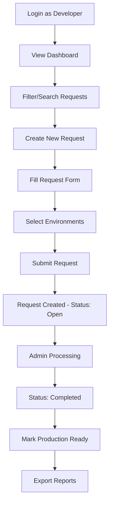
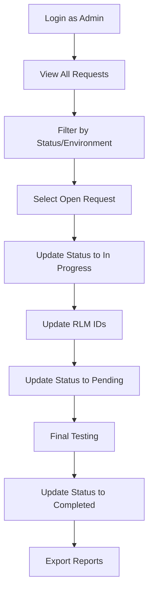
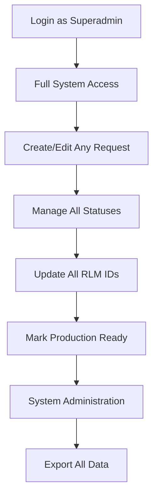

# Deployment Portal - Application Overview

## Table of Contents
1. [Business Purpose](#business-purpose)
2. [Key Features](#key-features)
3. [User Roles & Permissions](#user-roles--permissions)
4. [Application Flow](#application-flow)
5. [Core Entities](#core-entities)
6. [Business Rules](#business-rules)
7. [Workflows](#workflows)

---

## Business Purpose

The Deployment Portal is a comprehensive web application designed to streamline and manage software deployment requests across multiple environments. It serves as a centralized platform where development teams can submit deployment requests, track their progress, and collaborate with administrators to ensure smooth software releases.

### Key Business Objectives:
- **Centralized Request Management:** Single source of truth for all deployment requests
- **Role-Based Workflow:** Clear separation of responsibilities between developers and administrators
- **Environment Tracking:** Comprehensive monitoring across DEV, UAT, PERF, and PROD environments
- **Audit Trail:** Complete history of changes and status updates
- **Production Readiness:** Formal process for marking deployments as production-ready
- **Reporting & Analytics:** Export capabilities for management reporting

---

## Key Features

### 🔐 Authentication & Authorization
- **Session-based Authentication:** Secure login with 12-hour session persistence
- **Role-based Access Control:** Three distinct user roles with specific permissions
- **Automatic Session Management:** Users remain logged in unless they logout or session expires

### 📋 Request Management
- **Create Requests:** Developers can submit new deployment requests
- **Edit Requests:** Role-based editing with status restrictions
- **Status Tracking:** Four-stage status progression (Open → In Progress → Pending → Completed)
- **Real-time Updates:** Live status changes and date tracking

### 🔍 Advanced Filtering & Search
- **Multi-dimensional Filtering:**
  - Status (Open, In Progress, Pending, Completed)
  - Environment (DEV1-3, UAT1-3, PERF1-2, PROD1-2)
  - Team (Phoenix, Crusaders, Transformers, Avengers, CRUD, Hyper Care)
  - Service (180+ predefined services in aaa-bbb-ccc format)
  - Release (12+ release branches)
  - Config (Yes/No for configuration requests)
  - Production Ready (Yes/No/All)

- **Universal Search:** Intelligent search across:
  - MSDR numbers (Serial Numbers)
  - Service names
  - Dates (requested and modified)

### 🎯 Environment Management
- **Multi-Environment Support:**
  - **Development:** DEV1, DEV2, DEV3
  - **User Acceptance Testing:** UAT1, UAT2, UAT3
  - **Performance Testing:** PERF1, PERF2
  - **Production:** PROD1, PROD2

- **Environment-Specific RLM IDs:** Unique tracking identifiers per environment
- **Selective Environment Requests:** Deployments can target specific environments

### ✅ Production Ready Process
- **Completion Requirement:** Only available for requests with "Completed" status
- **Role-based Authorization:** Only original requester (developer) or superadmin can mark as production ready
- **Audit Trail:** All changes tracked with timestamps

### � Release Management  
- **Release Creation:** Admin and Super Admin can create new releases
- **YYYY-MM Format:** Standardized release naming (e.g., 2025-01, 2025-12)
- **Release Validation:** Automatic format validation and uniqueness checks
- **Release Tracking:** All deployments linked to specific releases
- **Chronological Display:** Releases sorted with newest first

### �📊 Reporting & Export
- **CSV Export:** Comprehensive data export with all fields
- **Filtered Exports:** Apply same filters to export functionality
- **Date Range Filtering:** Export deployments by requested date range
- **Management Reporting:** Complete audit trail for compliance

---

## User Roles & Permissions

### 🦸‍♂️ Superadmin
**Full system access with all permissions**

**Can Do:**
- ✅ View all deployment requests
- ✅ Create new deployment requests
- ✅ Edit any request (full edit dialog access)
- ✅ Update status of any request
- ✅ Edit all RLM IDs
- ✅ Mark any completed request as production ready
- ✅ Export data with all filters
- ✅ Access all environments and teams

**UI Access:**
- Full edit dialog for any request
- Status dropdown in request details
- All RLM ID fields (editable)
- Production ready checkbox for completed requests
- All filter options
- New Request button

### 👨‍💼 Admin
**Administrative privileges with restrictions**

**Can Do:**
- ✅ View all deployment requests
- ✅ Update status of any request (inline editing)
- ✅ Edit all RLM IDs (inline editing)
- ✅ Export data with all filters
- ✅ Access all environments and teams

**Cannot Do:**
- ❌ Create new deployment requests
- ❌ Use full edit dialog (only inline editing)
- ❌ Mark requests as production ready
- ❌ Edit core request fields (service, team, etc.)

**UI Access:**
- Status dropdown in request details
- All RLM ID fields (editable)
- No production ready checkbox access
- All filter options
- No New Request button
- No Edit Request button

### 👨‍💻 Developer
**Request creators with limited editing rights**

**Can Do:**
- ✅ View all deployment requests
- ✅ Create new deployment requests
- ✅ Edit their own requests (when status is Open or Pending)
- ✅ Mark their own completed requests as production ready
- ✅ Export data with all filters

**Cannot Do:**
- ❌ Edit requests created by others
- ❌ Update status of any request
- ❌ Edit RLM IDs
- ❌ Mark others' requests as production ready

**UI Access:**
- Edit dialog for own requests (status restrictions apply)
- Production ready checkbox for own completed requests
- All filter options (view only)
- New Request button
- Edit Request button (for own requests only)

---

## Application Flow

### 1. Authentication Flow
```
User Login → Session Creation → Role-based UI Rendering → 12-hour Session → Auto-logout/Manual Logout
```

### 2. Request Creation Flow (Developer)
```
Login as Developer → Click "New Request" → Fill Form → Select Environments → Submit → Request Created with "Open" Status
```

### 3. Request Processing Flow (Admin/Superadmin)
```
Request Created → Admin Updates Status to "In Progress" → Admin Updates RLM IDs → Admin Updates Status to "Pending" → Admin Updates Status to "Completed"
```

### 4. Production Ready Flow (Developer/Superadmin)
```
Request Status = "Completed" → Original Requester/Superadmin → Check "Production Ready" → Click Update → Audit Trail Updated
```

### 5. Search & Filter Flow
```
Main Dashboard → Apply Filters → Real-time List Update → Select Request → View Details → Apply Different Filters → Export if Needed
```

---

## Core Entities

### 🎫 Deployment Request
**Primary entity representing a deployment request**

**Core Fields:**
- **Serial Number:** Unique identifier (MSDR0000XXX format)
- **CSI ID:** Customer Service Identifier (172033, 172223, 169608)
- **Service:** Selected from 180+ predefined services
- **Request ID:** Business request identifier
- **Team:** Development team (Phoenix, Crusaders, etc.)
- **Release:** Release branch information
- **Status:** Current request status
- **Created By:** Original requester username
- **Environments:** List of target environments

**Tracking Fields:**
- **Date Requested:** Initial creation timestamp
- **Date Modified:** Last update timestamp
- **Production Ready:** Boolean flag for production readiness

**Configuration Fields:**
- **Is Config:** Boolean flag for configuration requests
- **Config Request ID:** Associated configuration request ID

**RLM ID Fields (per environment):**
- **Development:** rlmIdDev1, rlmIdDev2, rlmIdDev3
- **UAT:** rlmIdUat1, rlmIdUat2, rlmIdUat3
- **Performance:** rlmIdPerf1, rlmIdPerf2
- **Production:** rlmIdProd1, rlmIdProd2

### 👤 User
**User account with role-based permissions**

**Fields:**
- **Username:** Unique user identifier
- **Password:** Encrypted password
- **Role:** User role (superadmin, admin, developer)

**Sample Users:**
- superadmin/admin123 (Superadmin)
- admin1/admin123, admin2/admin123 (Admin)
- dev1/dev123, dev2/dev123, dev3/dev123 (Developer)

### 🔧 Service
**Predefined services for deployment requests**

**Fields:**
- **Name:** Service name in aaa-bbb-ccc format
- **Description:** Service description

**Examples:**
- api-gateway-service
- user-management-service
- payment-processing-service
- data-analytics-service

### 📦 Release
**Release information for deployment tracking**

**Fields:**
- **Name:** Release name in YYYY-MM format (e.g., 2025-01, 2025-12)
- **Description:** Release description

**Creation Rules:**
- Only Admin and Super Admin users can create releases
- Name must follow YYYY-MM format strictly
- Year must be between 2024-2030
- Month must be 01-12
- Release names must be unique
- Descriptions cannot be empty

**Examples:**
- 2025-01: "January 2025 feature release"
- 2025-06: "June 2025 mid-year release" 
- 2025-12: "December 2025 year-end release"

---

## Business Rules

### Status Progression Rules
1. **New requests default to "Open" status**
2. **Status progression:** Open → In Progress → Pending → Completed
3. **Developers cannot change status** (except through request editing)
4. **Admins and Superadmins can change any status**
5. **Status changes update the "Date Modified" field**

### Production Ready Rules
1. **Only available when status is "Completed"**
2. **Only original requester (developer) or superadmin can mark as production ready**
3. **Production ready changes update the "Date Modified" field**
4. **Production ready flag persists across sessions**

### RLM ID Rules
1. **RLM IDs are environment-specific**
2. **Only admins and superadmins can edit RLM IDs**
3. **RLM IDs are always visible (read-only for developers)**
4. **RLM fields shown based on requested environments**
5. **Performance and Production RLM fields always visible**

### Request Editing Rules
1. **Developers can edit own requests when status is "Open" or "Pending"**
2. **Developers cannot edit requests in "In Progress" or "Completed" status**
3. **Superadmins can edit any request at any time**
4. **Admins use inline editing only (no full edit dialog)**

### Environment Rules
1. **Requests must specify at least one environment**
2. **Environment selection affects RLM ID visibility**
3. **Development environments:** DEV1, DEV2, DEV3
4. **UAT environments:** UAT1, UAT2, UAT3
5. **Performance environments:** PERF1, PERF2 (always visible)**
6. **Production environments:** PROD1, PROD2 (always visible)**

### Data Validation Rules
1. **All requests must have valid CSI ID** (172033, 172223, 169608)
2. **Service must be selected from predefined list**
3. **Team must be from approved list**
4. **Status must be one of four valid values**
5. **Serial numbers follow MSDR0000XXX format**

---

## Workflows

### Developer Workflow


### Admin Workflow


### Superadmin Workflow


---

## Additional Features

### Session Management
- **12-hour session duration**
- **Automatic session extension on activity**
- **Secure session storage**
- **Cross-tab session sharing**

### UI/UX Features
- **Responsive design** for desktop and mobile
- **Real-time updates** without page refresh
- **Color-coded status indicators**
- **Intuitive filtering interface**
- **Modern Angular Material design**

### Data Export
- **CSV format with all fields**
- **Filtered export capabilities**
- **Complete audit trail**
- **Management reporting ready**

### Security
- **Role-based access control**
- **Session-based authentication**
- **Input validation and sanitization**
- **Secure password storage**
- **CORS protection**

This application represents a complete deployment management solution with enterprise-grade features, security, and usability.
