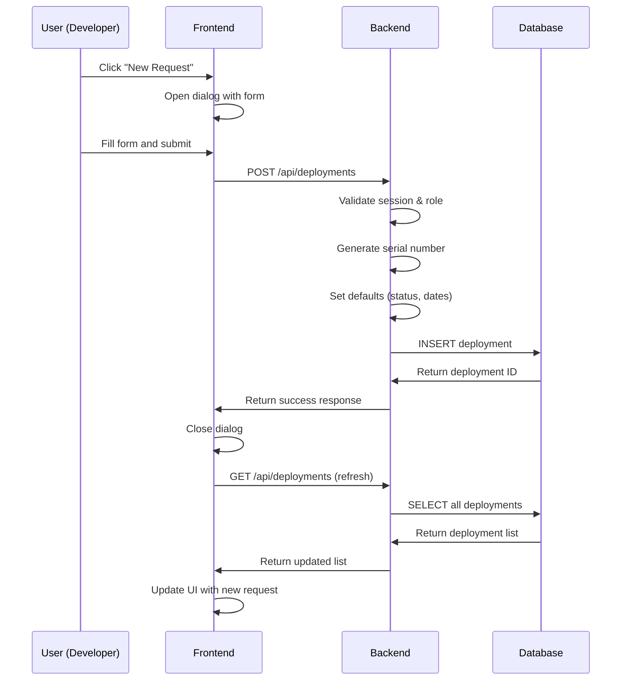
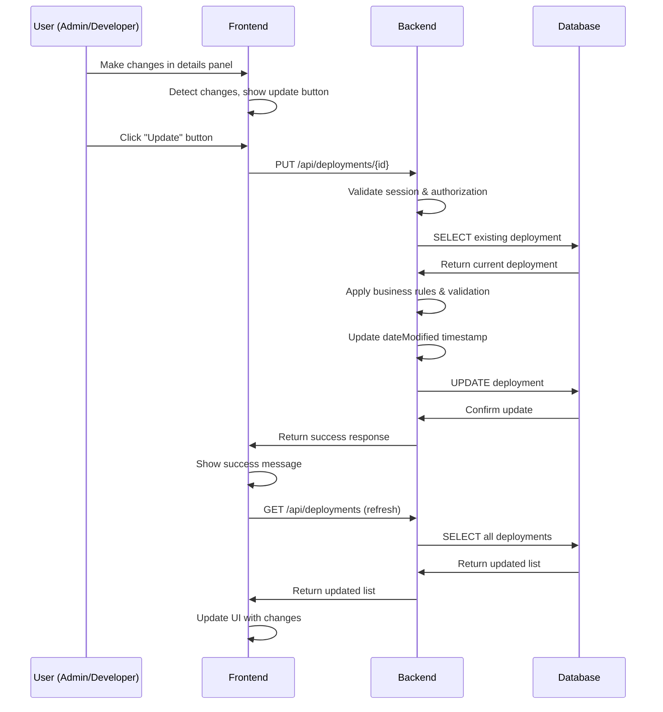

# Deployment Portal - Technical Documentation

## Table of Contents
1. [Architecture Overview](#architecture-overview)
2. [Backend Technical Details](#backend-technical-details)
3. [Frontend Technical Details](#frontend-technical-details)
4. [Security Implementation](#security-implementation)
5. [Data Flow & API Integration](#data-flow--api-integration)
6. [Performance & Optimization](#performance--optimization)
7. [Configuration & Environment](#configuration--environment)

---

## Architecture Overview

### System Architecture
```
┌─────────────────────────────────────────────────────────────┐
│                    Client Browser                           │
│  ┌─────────────────────────────────────────────────────┐   │
│  │             Angular Frontend                        │   │
│  │  ┌─────────────┐ ┌─────────────┐ ┌─────────────┐   │   │
│  │  │ Components  │ │  Services   │ │   Guards    │   │   │
│  │  └─────────────┘ └─────────────┘ └─────────────┘   │   │
│  └─────────────────────────────────────────────────────┘   │
└─────────────────────────────────────────────────────────────┘
                            │ HTTP/REST
                            ▼
┌─────────────────────────────────────────────────────────────┐
│                  Spring Boot Backend                       │
│  ┌─────────────────────────────────────────────────────┐   │
│  │               Web Layer                             │   │
│  │  ┌─────────────┐ ┌─────────────┐ ┌─────────────┐   │   │
│  │  │Controllers  │ │Security     │ │CORS Config  │   │   │
│  │  └─────────────┘ └─────────────┘ └─────────────┘   │   │
│  └─────────────────────────────────────────────────────┘   │
│  ┌─────────────────────────────────────────────────────┐   │
│  │              Service Layer                          │   │
│  │  ┌─────────────┐ ┌─────────────┐ ┌─────────────┐   │   │
│  │  │Deployment   │ │  Auth       │ │   User      │   │   │
│  │  │Service      │ │ Service     │ │  Service    │   │   │
│  │  └─────────────┘ └─────────────┘ └─────────────┘   │   │
│  └─────────────────────────────────────────────────────┘   │
│  ┌─────────────────────────────────────────────────────┐   │
│  │              Data Layer                             │   │
│  │  ┌─────────────┐ ┌─────────────┐ ┌─────────────┐   │   │
│  │  │JPA          │ │Repositories │ │   Entities  │   │   │
│  │  │Hibernate    │ │             │ │             │   │   │
│  │  └─────────────┘ └─────────────┘ └─────────────┘   │   │
│  └─────────────────────────────────────────────────────┘   │
└─────────────────────────────────────────────────────────────┘
                            │ JPA/Hibernate
                            ▼
┌─────────────────────────────────────────────────────────────┐
│                     H2 Database                            │
│  ┌─────────────┐ ┌─────────────┐ ┌─────────────┐         │
│  │Deployment   │ │    User     │ │   Service   │         │
│  │   Table     │ │   Table     │ │   Table     │         │
│  └─────────────┘ └─────────────┘ └─────────────┘         │
└─────────────────────────────────────────────────────────────┘
```

### Technology Stack

#### Backend Stack
- **Framework:** Spring Boot 2.7+
- **Language:** Java 17
- **Database:** H2 Database (embedded)
- **ORM:** JPA with Hibernate
- **Build Tool:** Maven 3.6+
- **Security:** Session-based authentication
- **Web Server:** Embedded Tomcat

#### Frontend Stack
- **Framework:** Angular 16+
- **Language:** TypeScript 4.9+
- **UI Library:** Angular Material 16+
- **Architecture:** Standalone Components
- **Build Tool:** Angular CLI
- **Package Manager:** npm

#### Development Tools
- **IDE:** VS Code, IntelliJ IDEA
- **Version Control:** Git
- **Testing:** JUnit 5, Jasmine/Karma
- **Documentation:** Markdown

---

## Backend Technical Details

### Project Structure
```
backend/deployment-portal/
├── src/
│   ├── main/
│   │   ├── java/com/deploymentportal/
│   │   │   ├── Application.java                 # Main Spring Boot application
│   │   │   ├── config/
│   │   │   │   └── SecurityConfig.java          # Security configuration
│   │   │   ├── controller/
│   │   │   │   ├── AuthController.java          # Authentication endpoints
│   │   │   │   └── DeploymentController.java    # Main API endpoints
│   │   │   ├── model/
│   │   │   │   ├── Deployment.java              # Main entity
│   │   │   │   ├── User.java                   # User entity
│   │   │   │   ├── Service.java                # Service entity
│   │   │   │   └── Release.java                # Release entity
│   │   │   └── repository/
│   │   │       ├── DeploymentRepository.java   # JPA repository
│   │   │       ├── UserRepository.java         # User data access
│   │   │       ├── ServiceRepository.java      # Service data access
│   │   │       └── ReleaseRepository.java      # Release data access
│   │   └── resources/
│   │       ├── application.properties           # Configuration
│   │       └── data.sql                        # Sample data
│   └── test/
│       └── java/com/deploymentportal/
│           └── AppTest.java                    # Basic tests
├── pom.xml                                     # Maven dependencies
└── target/                                     # Build output
```

### Core Entities

#### Deployment Entity
```java
@Entity
@Table(name = "deployment")
public class Deployment {
    @Id
    @GeneratedValue(strategy = GenerationType.IDENTITY)
    private Long id;
    
    // Core identification fields
    private String serialNumber;        // MSDR0000XXX format
    private String csiId;              // 172033, 172223, 169608
    private String service;            // Service name
    private String requestId;          // Business request ID
    
    // Business fields
    private String team;               // Development team
    private String release;            // Release branch
    private String status;             // Open, In Progress, Pending, Completed
    private String createdBy;          // Username who created request
    
    // Environment tracking
    @ElementCollection
    @CollectionTable(name = "deployment_environments")
    private List<String> environments; // Target environments
    
    // RLM IDs for each environment
    private String rlmIdUat1;
    private String rlmIdUat2;
    private String rlmIdUat3;
    private String rlmIdPerf1;
    private String rlmIdPerf2;
    private String rlmIdProd1;
    private String rlmIdProd2;
    
    // Configuration request fields
    private Boolean isConfig;          // Is this a config request
    private String configRequestId;    // Config request ID if applicable
    
    // Audit fields
    private LocalDateTime dateRequested;
    private LocalDateTime dateModified;
    
    // Production readiness
    private Boolean productionReady;
}
```

#### User Entity
```java
@Entity
@Table(name = "users")
public class User {
    @Id
    @GeneratedValue(strategy = GenerationType.IDENTITY)
    private Long id;
    
    private String username;           // Unique username
    private String password;           // Encrypted password
    private String role;              // superadmin, admin, developer
}
```

#### Service Entity
```java
@Entity
@Table(name = "service")
public class Service {
    @Id
    @GeneratedValue(strategy = GenerationType.IDENTITY)
    private Long id;
    
    private String name;              // Service name (aaa-bbb-ccc format)
    private String description;       // Service description
}
```

### REST API Endpoints

#### Authentication Endpoints
```java
// AuthController.java

@PostMapping("/api/auth/login")
public ResponseEntity<Map<String, Object>> login(
    @RequestBody Map<String, String> credentials, 
    HttpServletRequest request)
// Returns: User object + success message
// Session: Creates new session with user object

@PostMapping("/api/auth/logout")
public ResponseEntity<Map<String, String>> logout(HttpServletRequest request)
// Returns: Success message
// Session: Invalidates current session

@GetMapping("/api/auth/check")
public ResponseEntity<Map<String, Object>> checkAuth(HttpServletRequest request)
// Returns: Current user object if authenticated
// Session: Validates existing session
```

#### Deployment Management Endpoints
```java
// DeploymentController.java

@GetMapping("/api/deployments")
public List<Deployment> getAllDeployments(
    @RequestParam(required = false) String search)
// Returns: List of all deployments with optional search
// Search: MSDR numbers, service names, dates

@PostMapping("/api/deployments")
public ResponseEntity<Map<String, String>> createDeployment(
    @RequestBody Deployment deployment, 
    HttpServletRequest request)
// Creates: New deployment request
// Authorization: Developers and superadmins only
// Auto-sets: Serial number, date requested, created by

@PutMapping("/api/deployments/{id}")
public ResponseEntity<Map<String, String>> updateDeployment(
    @PathVariable Long id, 
    @RequestBody Deployment deployment, 
    HttpServletRequest request)
// Updates: Existing deployment
// Authorization: Role-based with production ready restrictions
// Auto-updates: Date modified

@GetMapping("/api/services")
public List<Service> getAllServices()
// Returns: List of all available services (180+ services)

@GetMapping("/api/releases")
public List<Release> getAllReleases()
// Returns: List of all available releases

@GetMapping("/api/reports/general")
public ResponseEntity<byte[]> generateReport(
    @RequestParam(required = false) String release,
    @RequestParam(required = false) String environment,
    @RequestParam(required = false) String team)
// Returns: CSV file with filtered deployment data
// Content-Type: text/csv
// Content-Disposition: attachment; filename="deployment_report.csv"
```

### Security Configuration

#### Session-Based Authentication
```java
@Configuration
@EnableWebSecurity
public class SecurityConfig {
    
    @Bean
    public SecurityFilterChain filterChain(HttpSecurity http) throws Exception {
        return http
            .authorizeHttpRequests(auth -> auth
                .requestMatchers("/api/**").permitAll()  // Allow all API access
                .anyRequest().authenticated()
            )
            .sessionManagement(session -> session
                .sessionCreationPolicy(SessionCreationPolicy.IF_REQUIRED)
                .maximumSessions(1)
                .maxSessionsPreventsLogin(false)
            )
            .csrf(csrf -> csrf.disable())
            .cors(cors -> cors.configurationSource(corsConfigurationSource()))
            .build();
    }
    
    @Bean
    public CorsConfigurationSource corsConfigurationSource() {
        CorsConfiguration configuration = new CorsConfiguration();
        configuration.setAllowedOrigins(Arrays.asList("http://localhost:4200"));
        configuration.setAllowedMethods(Arrays.asList("GET", "POST", "PUT", "DELETE"));
        configuration.setAllowedHeaders(Arrays.asList("*"));
        configuration.setAllowCredentials(true);
        return new UrlBasedCorsConfigurationSource(source -> {
            source.registerCorsConfiguration("/api/**", configuration);
        });
    }
}
```

#### Session Management
```java
// Session timeout: 12 hours (43200 seconds)
server.servlet.session.timeout=43200s

// Session persistence across restarts
server.servlet.session.persistent=true

// Session tracking
server.servlet.session.tracking-modes=cookie
```

### Database Configuration

#### H2 Database Setup
```properties
# application.properties

# H2 Database configuration
spring.datasource.url=jdbc:h2:mem:testdb
spring.datasource.driverClassName=org.h2.Driver
spring.datasource.username=sa
spring.datasource.password=

# JPA configuration
spring.jpa.database-platform=org.hibernate.dialect.H2Dialect
spring.jpa.hibernate.ddl-auto=create-drop
spring.jpa.show-sql=false

# H2 Console (for development)
spring.h2.console.enabled=true
spring.h2.console.path=/h2-console

# Session timeout
server.servlet.session.timeout=43200s
```

#### Sample Data Loading
```sql
-- data.sql

-- Insert sample users
INSERT INTO users (username, password, role) VALUES 
('superadmin', 'admin123', 'superadmin'),
('admin1', 'admin123', 'admin'),
('admin2', 'admin123', 'admin'),
('dev1', 'dev123', 'developer'),
('dev2', 'dev123', 'developer'),
('dev3', 'dev123', 'developer');

-- Insert 180 services in aaa-bbb-ccc format
INSERT INTO service (name, description) VALUES 
('api-gateway-service', 'API Gateway Service'),
('user-management-service', 'User Management Service'),
-- ... 178 more services

-- Insert releases
INSERT INTO release (name, description) VALUES 
('January', 'January Release'),
('February', 'February Release'),
-- ... 10 more releases

-- Insert 30+ deployment requests with comprehensive data
INSERT INTO deployment (...) VALUES (...);
```

### Data Relationships

#### Entity Relationships
```
User (1) ──────────────────────── (Many) Deployment
  │                                         │
  └── createdBy field references         └── Complex entity with:
      username                               ├── Basic fields
                                            ├── RLM ID fields  
                                            ├── Environment list
                                            └── Audit fields

Service (1) ────────────────────── (Many) Deployment
  │                                         │
  └── name field referenced           └── service field

Release (1) ────────────────────── (Many) Deployment
  │                                         │
  └── name field referenced           └── release field
```

---

## Frontend Technical Details

### Project Structure
```
frontend/deployment-portal-frontend/
├── src/
│   ├── app/
│   │   ├── app.component.ts                 # Main application component
│   │   ├── app.component.html              # Main application template
│   │   ├── app.component.css               # Main application styles
│   │   ├── app.config.ts                   # Application configuration
│   │   ├── app.module.ts                   # Application module (legacy)
│   │   ├── auth.service.ts                 # Authentication service
│   │   ├── deployment.service.ts           # Deployment data service
│   │   ├── models/
│   │   │   ├── deployment.interface.ts     # Deployment type definitions
│   │   │   ├── user.interface.ts           # User type definitions
│   │   │   └── service.interface.ts        # Service type definitions
│   │   ├── login/
│   │   │   ├── login.component.ts          # Login form component
│   │   │   ├── login.component.html        # Login template
│   │   │   └── login.component.css         # Login styles
│   │   ├── main-header/
│   │   │   └── main-header.component.ts    # Application header
│   │   ├── main-toolbar/
│   │   │   ├── main-toolbar.component.ts   # Filter toolbar
│   │   │   ├── main-toolbar.component.html # Toolbar template
│   │   │   └── main-toolbar.component.css  # Toolbar styles
│   │   ├── request-list/
│   │   │   └── request-list.component.ts   # Request list panel
│   │   ├── request-details/
│   │   │   ├── request-details.component.ts    # Request details panel
│   │   │   └── request-details.component.css   # Details styles
│   │   ├── bottom-toolbar/
│   │   │   └── bottom-toolbar.component.ts # Export toolbar
│   │   ├── new-request-dialog.component.ts # New request dialog
│   │   └── create-release-dialog/
│   │       ├── create-release-dialog.component.ts   # Create release dialog
│   │       ├── create-release-dialog.component.html # Release creation template
│   │       └── create-release-dialog.component.css  # Release dialog styles
│   ├── index.html                          # Main HTML file
│   ├── main.ts                            # Application bootstrap
│   ├── styles.css                         # Global styles
│   └── environments/
│       ├── environment.ts                 # Development environment
│       └── environment.prod.ts           # Production environment
├── angular.json                           # Angular CLI configuration
├── package.json                          # Dependencies
├── tsconfig.json                         # TypeScript configuration
└── proxy.conf.json                      # Development proxy
```

### Core Components

#### App Component (Main Application)
```typescript
@Component({
  selector: 'app-root',
  standalone: true,
  templateUrl: './app.component.html',
  styleUrls: ['./app.component.css'],
  imports: [/* All required modules */]
})
export class AppComponent implements OnInit {
  // State management
  user: any = null;
  deployments: any[] = [];
  filteredDeployments: any[] = [];
  selectedDeployment: any = null;
  
  // Filter properties
  statusFilter: string = '';
  envFilter: string = '';
  teamFilter: string = '';
  // ... more filters
  
  // Lifecycle and methods
  ngOnInit() { /* Initialize application */ }
  loadDeployments() { /* Load data from API */ }
  applyFilters() { /* Apply local filtering */ }
  onDeploymentUpdate() { /* Handle updates */ }
  // ... authentication and CRUD methods
}
```

#### Request Details Component
```typescript
@Component({
  selector: 'app-request-details',
  standalone: true,
  imports: [CommonModule, FormsModule],
  template: `/* Inline template with request details */`
})
export class RequestDetailsComponent implements OnChanges {
  @Input() deployment: any;
  @Input() user: any;
  @Output() deploymentUpdate = new EventEmitter<any>();
  
  // Local state for editing
  editableDeployment: any = {};
  originalDeployment: any = {};
  
  // Authorization methods
  get isAdmin(): boolean { /* Role checking */ }
  canEditProductionReady(): boolean { /* Permission logic */ }
  
  // Change detection
  hasChanges(): boolean { /* Detect modifications */ }
  hasProductionReadyChanges(): boolean { /* Production ready changes */ }
  
  // Update methods
  updateDeployment() { /* Admin/superadmin updates */ }
  updateProductionReady() { /* Production ready updates */ }
}
```

#### Main Toolbar Component
```typescript
@Component({
  selector: 'app-main-toolbar',
  standalone: true,
  templateUrl: './main-toolbar.component.html',
  styleUrls: ['./main-toolbar.component.css'],
  imports: [/* Material and form modules */]
})
export class MainToolbarComponent implements OnInit {
  // Filter inputs
  @Input() statusFilter: string = '';
  @Input() envFilter: string = '';
  @Input() teamFilter: string = '';
  // ... more filter inputs
  
  // Filter outputs
  @Output() statusFilterChange = new EventEmitter<string>();
  @Output() envFilterChange = new EventEmitter<string>();
  @Output() teamFilterChange = new EventEmitter<string>();
  // ... more filter outputs
  
  // Data sources
  services: Service[] = [];
  teams: string[] = ['Phoenix', 'Crusaders', /* ... */];
  
  // Event handlers
  onStatusChange(event: Event) { /* Emit filter changes */ }
  clearFilters() { /* Reset all filters */ }
}
```

#### Create Release Dialog Component
```typescript
@Component({
  selector: 'app-create-release-dialog',
  standalone: true,
  templateUrl: './create-release-dialog.component.html',
  styleUrls: ['./create-release-dialog.component.css'],
  imports: [CommonModule, FormsModule, MatDialogModule, MatFormFieldModule, MatInputModule, MatButtonModule]
})
export class CreateReleaseDialogComponent {
  releaseName: string = '';
  releaseDescription: string = '';
  
  constructor(
    private dialogRef: MatDialogRef<CreateReleaseDialogComponent>,
    private deploymentService: DeploymentService
  ) {}
  
  // Validation for YYYY-MM format
  isValidReleaseName(): boolean {
    const namePattern = /^\d{4}-(0[1-9]|1[0-2])$/;
    return namePattern.test(this.releaseName);
  }
  
  // Create release
  onCreate() {
    if (this.isValidReleaseName() && this.releaseDescription.trim()) {
      const newRelease = {
        name: this.releaseName,
        description: this.releaseDescription.trim()
      };
      
      this.deploymentService.createRelease(newRelease).subscribe({
        next: (response) => {
          this.dialogRef.close(response);
        },
        error: (error) => {
          alert('Error creating release: ' + error.error.error);
        }
      });
    }
  }
  
  onCancel() {
    this.dialogRef.close();
  }
}
```

### Services

#### Deployment Service
```typescript
@Injectable({
  providedIn: 'root'
})
export class DeploymentService {
  private apiUrl = 'http://localhost:8080/api';
  
  constructor(private http: HttpClient) {}
  
  // CRUD operations
  getAllDeployments(search?: string): Observable<any[]> {
    const params = search ? { search } : {};
    return this.http.get<any[]>(`${this.apiUrl}/deployments`, { params });
  }
  
  createDeployment(deployment: any): Observable<any> {
    return this.http.post<any>(`${this.apiUrl}/deployments`, deployment);
  }
  
  updateDeployment(id: number, deployment: any): Observable<any> {
    return this.http.put<any>(`${this.apiUrl}/deployments/${id}`, deployment);
  }
  
  // Supporting data
  getAllServices(): Observable<any[]> {
    return this.http.get<any[]>(`${this.apiUrl}/services`);
  }
  
  getReleases(): Observable<any[]> {
    return this.http.get<any[]>(`${this.apiUrl}/releases`);
  }
  
  // Export functionality
  exportCSV(filters: any): Observable<Blob> {
    return this.http.get(`${this.apiUrl}/reports/general`, {
      params: filters,
      responseType: 'blob'
    });
  }
}
```

#### Authentication Service
```typescript
@Injectable({
  providedIn: 'root'
})
export class AuthService {
  private apiUrl = 'http://localhost:8080/api/auth';
  
  constructor(private http: HttpClient) {}
  
  login(username: string, password: string): Observable<any> {
    return this.http.post<any>(`${this.apiUrl}/login`, {
      username,
      password
    });
  }
  
  logout(): Observable<any> {
    return this.http.post<any>(`${this.apiUrl}/logout`, {});
  }
  
  checkAuth(): Observable<any> {
    return this.http.get<any>(`${this.apiUrl}/check`);
  }
}
```

### Type Definitions

#### Deployment Interface
```typescript
export interface Deployment {
  id?: number;
  serialNumber: string;
  csiId: string;
  service: string;
  requestId: string;
  team: string;
  release: string;
  status: 'Open' | 'In Progress' | 'Pending' | 'Completed';
  createdBy: string;
  environments: string[];
  
  // RLM IDs
  rlmIdUat1?: string;
  rlmIdUat2?: string;
  rlmIdUat3?: string;
  rlmIdPerf1?: string;
  rlmIdPerf2?: string;
  rlmIdProd1?: string;
  rlmIdProd2?: string;
  
  // Configuration
  isConfig?: boolean;
  configRequestId?: string;
  
  // Audit
  dateRequested?: string;
  dateModified?: string;
  productionReady?: boolean;
}
```

#### User Interface
```typescript
export interface User {
  id?: number;
  username: string;
  password?: string;
  role: 'superadmin' | 'admin' | 'developer';
}
```

### Angular Material Integration

#### Material Modules Used
```typescript
// Import statements in components
import { MatButtonModule } from '@angular/material/button';
import { MatInputModule } from '@angular/material/input';
import { MatSelectModule } from '@angular/material/select';
import { MatFormFieldModule } from '@angular/material/form-field';
import { MatDialogModule } from '@angular/material/dialog';
import { MatIconModule } from '@angular/material/icon';
import { MatCheckboxModule } from '@angular/material/checkbox';
```

#### Material Components Usage
- **Mat-Select:** Filter dropdowns in toolbar
- **Mat-Input:** Form inputs and search fields
- **Mat-Button:** Action buttons throughout
- **Mat-Dialog:** New request and edit dialogs
- **Mat-Form-Field:** Form field wrappers
- **Mat-Icon:** Icons for actions and status
- **Mat-Checkbox:** Production ready and config checkboxes

---

## Security Implementation

### Authentication Flow

#### Session-Based Authentication
```typescript
// Frontend login process
login(credentials: {username: string, password: string}) {
  return this.authService.login(credentials.username, credentials.password)
    .subscribe({
      next: (response) => {
        // Store user in component state
        this.user = response.user;
        this.showLogin = false;
        
        // Session is automatically managed by browser cookies
        // No token storage needed
      },
      error: (error) => {
        // Handle login failure
        alert('Login failed');
      }
    });
}
```

```java
// Backend session creation
@PostMapping("/api/auth/login")
public ResponseEntity<Map<String, Object>> login(@RequestBody Map<String, String> credentials, HttpServletRequest request) {
    // Validate credentials
    User user = userRepository.findByUsername(username);
    if (user != null && user.getPassword().equals(password)) {
        // Create session
        HttpSession session = request.getSession(true);
        session.setAttribute("user", user);
        session.setMaxInactiveInterval(43200); // 12 hours
        
        return ResponseEntity.ok(Map.of(
            "user", user,
            "message", "Login successful"
        ));
    }
    return ResponseEntity.status(HttpStatus.UNAUTHORIZED)
        .body(Map.of("error", "Invalid credentials"));
}
```

### Authorization Implementation

#### Role-Based Access Control
```typescript
// Frontend authorization checks
export class RequestDetailsComponent {
  get isAdmin(): boolean {
    return this.user?.role === 'admin' || this.user?.role === 'superadmin';
  }
  
  canEditProductionReady(): boolean {
    return this.deployment?.status === 'Completed' && 
           (this.user?.role === 'superadmin' || 
            this.user?.username === this.deployment?.createdBy);
  }
  
  get canEditRlm(): boolean {
    return this.user?.role === 'admin' || this.user?.role === 'superadmin';
  }
}
```

```java
// Backend authorization checks
@PutMapping("/api/deployments/{id}")
public ResponseEntity<Map<String, String>> updateDeployment(@PathVariable Long id, @RequestBody Deployment deployment, HttpServletRequest request) {
    // Session validation
    HttpSession session = request.getSession(false);
    if (session == null || session.getAttribute("user") == null) {
        return ResponseEntity.status(HttpStatus.UNAUTHORIZED)
            .body(Map.of("error", "Unauthorized"));
    }
    
    User currentUser = (User) session.getAttribute("user");
    Deployment existingDeployment = deploymentRepository.findById(id).orElse(null);
    
    // Production ready authorization
    if (deployment.getProductionReady() != null && 
        deployment.getProductionReady() != existingDeployment.getProductionReady()) {
        
        if (!"Completed".equals(existingDeployment.getStatus())) {
            return ResponseEntity.badRequest()
                .body(Map.of("error", "Can only mark as production ready when status is Completed"));
        }
        
        if (!(currentUser.getRole().equals("superadmin") || 
              currentUser.getUsername().equals(existingDeployment.getCreatedBy()))) {
            return ResponseEntity.status(HttpStatus.FORBIDDEN)
                .body(Map.of("error", "Only requester or super admin can mark as production ready"));
        }
    }
    
    // Continue with update...
}
```

### Session Management

#### Frontend Session Handling
```typescript
// Automatic session validation
export class AppComponent implements OnInit {
  ngOnInit() {
    // Check existing session on app load
    this.authService.checkAuth().subscribe({
      next: (response) => {
        this.user = response.user;
        this.showLogin = false;
        this.loadDeployments();
      },
      error: () => {
        // No valid session, show login
        this.showLogin = true;
      }
    });
  }
  
  // Manual logout
  logout() {
    this.authService.logout().subscribe({
      next: () => {
        this.user = null;
        this.showLogin = true;
        this.deployments = [];
        this.selectedDeployment = null;
      }
    });
  }
}
```

#### HTTP Interceptor for Session Management
```typescript
// Optional: HTTP interceptor to handle session expiry
@Injectable()
export class AuthInterceptor implements HttpInterceptor {
  intercept(req: HttpRequest<any>, next: HttpHandler): Observable<HttpEvent<any>> {
    // Add credentials to all requests
    const authReq = req.clone({
      withCredentials: true
    });
    
    return next.handle(authReq).pipe(
      catchError((error: HttpErrorResponse) => {
        if (error.status === 401) {
          // Session expired, redirect to login
          this.router.navigate(['/login']);
        }
        return throwError(error);
      })
    );
  }
}
```

### CORS Configuration

#### Cross-Origin Resource Sharing
```java
@Bean
public CorsConfigurationSource corsConfigurationSource() {
    CorsConfiguration configuration = new CorsConfiguration();
    
    // Allow frontend origin
    configuration.setAllowedOrigins(Arrays.asList("http://localhost:4200"));
    
    // Allow standard HTTP methods
    configuration.setAllowedMethods(Arrays.asList("GET", "POST", "PUT", "DELETE", "OPTIONS"));
    
    // Allow all headers
    configuration.setAllowedHeaders(Arrays.asList("*"));
    
    // Allow credentials (cookies/sessions)
    configuration.setAllowCredentials(true);
    
    UrlBasedCorsConfigurationSource source = new UrlBasedCorsConfigurationSource();
    source.registerCorsConfiguration("/api/**", configuration);
    return source;
}
```

---

## Data Flow & API Integration

### Request Lifecycle

#### Create Request Flow


#### Update Request Flow


### Filtering & Search Flow

#### Client-Side Filtering
```typescript
// Applied for status, environment, team, etc.
applyFilters() {
  let filtered = this.deployments;
  
  if (this.statusFilter) {
    filtered = filtered.filter(d => 
      (d.status || '').toLowerCase() === this.statusFilter.toLowerCase()
    );
  }
  
  if (this.envFilter) {
    filtered = filtered.filter(d => 
      (d.environments || []).includes(this.envFilter)
    );
  }
  
  if (this.teamFilter) {
    filtered = filtered.filter(d => 
      (d.team || '').toLowerCase() === this.teamFilter.toLowerCase()
    );
  }
  
  // Apply other filters...
  
  this.filteredDeployments = filtered;
}
```

#### Server-Side Search
```typescript
// Universal search handled by backend
onSearchChange(searchQuery: string) {
  this.searchQuery = searchQuery;
  this.loadDeployments(searchQuery.trim() || undefined);
}

loadDeployments(search?: string) {
  this.deploymentService.getAllDeployments(search).subscribe({
    next: (data) => {
      this.deployments = data;
      this.applyFilters(); // Apply client-side filters to search results
    },
    error: () => alert('Error loading deployments')
  });
}
```

```java
// Backend search implementation
@GetMapping("/api/deployments")
public List<Deployment> getAllDeployments(@RequestParam(required = false) String search) {
    List<Deployment> deployments = deploymentRepository.findAll();
    
    if (search != null && !search.trim().isEmpty()) {
        String searchLower = search.toLowerCase();
        return deployments.stream()
            .filter(d -> 
                d.getSerialNumber().toLowerCase().contains(searchLower) ||
                (d.getService() != null && d.getService().toLowerCase().contains(searchLower)) ||
                (d.getTeam() != null && d.getTeam().toLowerCase().contains(searchLower)) ||
                (d.getDateRequested() != null && d.getDateRequested().toString().contains(searchLower)) ||
                (d.getDateModified() != null && d.getDateModified().toString().contains(searchLower))
            )
            .collect(Collectors.toList());
    }
    
    return deployments;
}
```

### CSV Export Flow

#### Export Process
```typescript
// Frontend export trigger
exportCSV() {
  const filters = {
    release: this.exportReleaseFilter || undefined,
    environment: this.exportEnvFilter || undefined,
    team: this.exportTeamFilter || undefined
  };
  
  this.deploymentService.exportCSV(filters).subscribe({
    next: (blob) => {
      // Create download link
      const url = window.URL.createObjectURL(blob);
      const a = document.createElement('a');
      a.href = url;
      a.download = `deployment_report_${new Date().toISOString().split('T')[0]}.csv`;
      document.body.appendChild(a);
      a.click();
      document.body.removeChild(a);
      window.URL.revokeObjectURL(url);
    },
    error: () => alert('Error exporting data')
  });
}
```

```java
// Backend CSV generation
@GetMapping("/api/reports/general")
public ResponseEntity<byte[]> generateReport(
    @RequestParam(required = false) String release,
    @RequestParam(required = false) String environment,
    @RequestParam(required = false) String team) {
    
    List<Deployment> deployments = deploymentRepository.findAll();
    
    // Apply filters
    if (release != null && !release.isEmpty() && !release.equals("all")) {
        deployments = deployments.stream()
            .filter(d -> release.equalsIgnoreCase(d.getRelease()))
            .collect(Collectors.toList());
    }
    
    if (environment != null && !environment.isEmpty() && !environment.equals("all")) {
        deployments = deployments.stream()
            .filter(d -> d.getEnvironments() != null && d.getEnvironments().contains(environment))
            .collect(Collectors.toList());
    }
    
    if (team != null && !team.isEmpty() && !team.equals("all")) {
        deployments = deployments.stream()
            .filter(d -> team.equalsIgnoreCase(d.getTeam()))
            .collect(Collectors.toList());
    }
    
    // Generate CSV
    StringBuilder csv = new StringBuilder();
    csv.append("Serial Number,CSI ID,Service,Request ID,Environments,Team,Release,Status,Created By,Date Requested,Date Modified,RLM ID UAT1,RLM ID UAT2,RLM ID UAT3,RLM ID PERF1,RLM ID PERF2,RLM ID PROD1,RLM ID PROD2\n");
    
    for (Deployment d : deployments) {
        csv.append(String.format("%s,%s,%s,%s,\"%s\",%s,%s,%s,%s,%s,%s,%s,%s,%s,%s,%s,%s,%s\n",
            d.getSerialNumber(),
            d.getCsiId(),
            d.getService() != null ? d.getService() : "",
            d.getRequestId() != null ? d.getRequestId() : "",
            d.getEnvironments() != null ? String.join(",", d.getEnvironments()) : "",
            d.getTeam() != null ? d.getTeam() : "",
            d.getRelease() != null ? d.getRelease() : "",
            d.getStatus() != null ? d.getStatus() : "",
            d.getCreatedBy() != null ? d.getCreatedBy() : "",
            d.getDateRequested() != null ? d.getDateRequested().toString() : "",
            d.getDateModified() != null ? d.getDateModified().toString() : "",
            d.getRlmIdUat1() != null ? d.getRlmIdUat1() : "",
            d.getRlmIdUat2() != null ? d.getRlmIdUat2() : "",
            d.getRlmIdUat3() != null ? d.getRlmIdUat3() : "",
            d.getRlmIdPerf1() != null ? d.getRlmIdPerf1() : "",
            d.getRlmIdPerf2() != null ? d.getRlmIdPerf2() : "",
            d.getRlmIdProd1() != null ? d.getRlmIdProd1() : "",
            d.getRlmIdProd2() != null ? d.getRlmIdProd2() : ""
        ));
    }
    
    byte[] csvBytes = csv.toString().getBytes(StandardCharsets.UTF_8);
    
    HttpHeaders headers = new HttpHeaders();
    headers.setContentType(MediaType.parseMediaType("text/csv"));
    headers.setContentDisposition(ContentDisposition.builder("attachment")
        .filename("deployment_report.csv")
        .build());
    
    return ResponseEntity.ok()
        .headers(headers)
        .body(csvBytes);
}
```

---

## Performance & Optimization

### Frontend Optimization

#### Component Optimization
```typescript
// Use OnPush change detection for better performance
@Component({
  changeDetection: ChangeDetectionStrategy.OnPush,
  // ...
})
export class RequestListComponent {
  // Immutable updates for better change detection
  updateDeployments(newDeployments: Deployment[]) {
    this.deployments = [...newDeployments]; // Create new array reference
  }
}

// TrackBy functions for ngFor loops
trackByDeploymentId(index: number, deployment: Deployment): number {
  return deployment.id || index;
}
```

#### Lazy Loading & Code Splitting
```typescript
// Lazy load components when needed
const NewRequestDialogComponent = lazy(() => import('./new-request-dialog.component'));

// Dynamic imports for large components
async openEditDialog() {
  const { EditRequestDialogComponent } = await import('./edit-request-dialog.component');
  // Use component...
}
```

#### HTTP Optimization
```typescript
// HTTP client configuration
@Injectable()
export class DeploymentService {
  constructor(private http: HttpClient) {
    // Configure HTTP client with interceptors
    this.http = http;
  }
  
  // Implement caching for static data
  private serviceCache: Service[] | null = null;
  
  getAllServices(): Observable<Service[]> {
    if (this.serviceCache) {
      return of(this.serviceCache);
    }
    
    return this.http.get<Service[]>(`${this.apiUrl}/services`)
      .pipe(
        tap(services => this.serviceCache = services),
        shareReplay(1) // Cache and share the result
      );
  }
}
```

### Backend Optimization

#### Database Optimization
```java
// Repository with optimized queries
@Repository
public interface DeploymentRepository extends JpaRepository<Deployment, Long> {
    
    // Custom query with JOIN FETCH for environment collections
    @Query("SELECT d FROM Deployment d LEFT JOIN FETCH d.environments WHERE d.status = :status")
    List<Deployment> findByStatusWithEnvironments(@Param("status") String status);
    
    // Projection for list views (reduce data transfer)
    @Query("SELECT new com.deploymentportal.dto.DeploymentSummary(d.id, d.serialNumber, d.service, d.status, d.team) FROM Deployment d")
    List<DeploymentSummary> findAllSummaries();
    
    // Index hints for better performance
    @Query(value = "SELECT * FROM deployment USE INDEX(idx_status_created_by) WHERE status = ?1 AND created_by = ?2", nativeQuery = true)
    List<Deployment> findByStatusAndCreatedByOptimized(String status, String createdBy);
}
```

#### Caching Strategy
```java
// Enable caching for frequently accessed data
@Service
@Transactional(readOnly = true)
public class DeploymentService {
    
    @Cacheable("services")
    public List<Service> getAllServices() {
        return serviceRepository.findAll();
    }
    
    @Cacheable("releases")
    public List<Release> getAllReleases() {
        return releaseRepository.findAll();
    }
    
    @CacheEvict(value = "deployments", allEntries = true)
    @Transactional
    public Deployment updateDeployment(Long id, Deployment deployment) {
        // Update logic...
        return deploymentRepository.save(deployment);
    }
}
```

#### Connection Pool Optimization
```properties
# application.properties

# HikariCP connection pool settings
spring.datasource.hikari.connection-timeout=20000
spring.datasource.hikari.minimum-idle=5
spring.datasource.hikari.maximum-pool-size=20
spring.datasource.hikari.idle-timeout=300000
spring.datasource.hikari.max-lifetime=1200000

# JPA/Hibernate optimization
spring.jpa.hibernate.jdbc.batch_size=20
spring.jpa.hibernate.order_inserts=true
spring.jpa.hibernate.order_updates=true
spring.jpa.hibernate.jdbc.batch_versioned_data=true
```

### Memory Management

#### Frontend Memory Management
```typescript
// Proper subscription management
export class AppComponent implements OnInit, OnDestroy {
  private destroy$ = new Subject<void>();
  
  ngOnInit() {
    this.deploymentService.getAllDeployments()
      .pipe(takeUntil(this.destroy$))
      .subscribe(deployments => {
        this.deployments = deployments;
      });
  }
  
  ngOnDestroy() {
    this.destroy$.next();
    this.destroy$.complete();
  }
}

// Efficient list rendering
@Component({
  template: `
    <cdk-virtual-scroll-viewport itemSize="50" class="viewport">
      <div *cdkVirtualFor="let deployment of deployments; trackBy: trackByFn">
        <!-- Deployment item -->
      </div>
    </cdk-virtual-scroll-viewport>
  `
})
export class RequestListComponent {
  trackByFn(index: number, item: Deployment) {
    return item.id;
  }
}
```

---

## Configuration & Environment

### Development Configuration

#### Backend Development Settings
```properties
# application.properties (Development)

# Server configuration
server.port=8080
server.servlet.context-path=/

# Database configuration
spring.datasource.url=jdbc:h2:mem:testdb
spring.datasource.username=sa
spring.datasource.password=
spring.h2.console.enabled=true

# JPA configuration
spring.jpa.show-sql=true
spring.jpa.hibernate.ddl-auto=create-drop

# Session configuration
server.servlet.session.timeout=43200s
server.servlet.session.persistent=false

# Logging
logging.level.com.deploymentportal=DEBUG
logging.level.org.springframework.web=DEBUG
```

#### Frontend Development Settings
```typescript
// environment.ts
export const environment = {
  production: false,
  apiUrl: 'http://localhost:8080/api',
  enableDebugLogs: true
};

// proxy.conf.json
{
  "/api/*": {
    "target": "http://localhost:8080",
    "secure": false,
    "changeOrigin": true,
    "logLevel": "debug"
  }
}
```

#### Angular CLI Configuration
```json
// angular.json
{
  "serve": {
    "builder": "@angular-devkit/build-angular:dev-server",
    "options": {
      "proxyConfig": "proxy.conf.json",
      "host": "localhost",
      "port": 4200
    }
  },
  "build": {
    "builder": "@angular-devkit/build-angular:browser",
    "options": {
      "outputPath": "dist/deployment-portal-frontend",
      "index": "src/index.html",
      "main": "src/main.ts",
      "polyfills": "src/polyfills.ts",
      "tsConfig": "tsconfig.app.json",
      "assets": ["src/favicon.ico", "src/assets"],
      "styles": ["src/styles.css"],
      "scripts": []
    }
  }
}
```

### Production Configuration

#### Backend Production Settings
```properties
# application-prod.properties

# Server configuration
server.port=8080
server.servlet.context-path=/

# Database configuration (example with MySQL)
spring.datasource.url=jdbc:mysql://localhost:3306/deploymentportal
spring.datasource.username=${DB_USERNAME}
spring.datasource.password=${DB_PASSWORD}
spring.datasource.driver-class-name=com.mysql.cj.jdbc.Driver

# JPA configuration
spring.jpa.hibernate.ddl-auto=validate
spring.jpa.show-sql=false
spring.jpa.database-platform=org.hibernate.dialect.MySQL8Dialect

# Session configuration
server.servlet.session.timeout=43200s
server.servlet.session.persistent=true
server.servlet.session.store-type=jdbc

# Security
server.ssl.enabled=true
server.ssl.key-store=${SSL_KEYSTORE_PATH}
server.ssl.key-store-password=${SSL_KEYSTORE_PASSWORD}

# Logging
logging.level.com.deploymentportal=INFO
logging.level.org.springframework.web=WARN
logging.file.name=logs/deployment-portal.log
```

#### Frontend Production Settings
```typescript
// environment.prod.ts
export const environment = {
  production: true,
  apiUrl: 'https://your-domain.com/api',
  enableDebugLogs: false
};
```

### Build Configuration

#### Maven Build Configuration
```xml
<!-- pom.xml -->
<build>
    <plugins>
        <plugin>
            <groupId>org.springframework.boot</groupId>
            <artifactId>spring-boot-maven-plugin</artifactId>
            <configuration>
                <profiles>
                    <profile>prod</profile>
                </profiles>
            </configuration>
        </plugin>
        
        <plugin>
            <groupId>org.apache.maven.plugins</groupId>
            <artifactId>maven-compiler-plugin</artifactId>
            <version>3.11.0</version>
            <configuration>
                <source>17</source>
                <target>17</target>
            </configuration>
        </plugin>
    </plugins>
</build>

<profiles>
    <profile>
        <id>dev</id>
        <activation>
            <activeByDefault>true</activeByDefault>
        </activation>
        <properties>
            <spring.profiles.active>dev</spring.profiles.active>
        </properties>
    </profile>
    
    <profile>
        <id>prod</id>
        <properties>
            <spring.profiles.active>prod</spring.profiles.active>
        </properties>
    </profile>
</profiles>
```

#### Docker Configuration
```dockerfile
# Dockerfile (Backend)
FROM openjdk:17-jdk-slim

WORKDIR /app

COPY target/deployment-portal-*.jar app.jar

EXPOSE 8080

ENV SPRING_PROFILES_ACTIVE=prod

CMD ["java", "-jar", "app.jar"]
```

```dockerfile
# Dockerfile (Frontend)
FROM node:18-alpine AS builder

WORKDIR /app

COPY package*.json ./
RUN npm ci

COPY . .
RUN npm run build --prod

FROM nginx:alpine

COPY --from=builder /app/dist/deployment-portal-frontend /usr/share/nginx/html
COPY nginx.conf /etc/nginx/conf.d/default.conf

EXPOSE 80

CMD ["nginx", "-g", "daemon off;"]
```

### Environment Variables

#### Backend Environment Variables
```bash
# Production environment variables
export DB_USERNAME=deployment_user
export DB_PASSWORD=secure_password
export SSL_KEYSTORE_PATH=/etc/ssl/keystore.p12
export SSL_KEYSTORE_PASSWORD=keystore_password
export SPRING_PROFILES_ACTIVE=prod
export LOG_LEVEL=INFO
```

#### Frontend Environment Variables
```bash
# Build-time environment variables
export API_URL=https://api.your-domain.com
export ENVIRONMENT=production
export BUILD_VERSION=1.0.0
```

This technical documentation provides a complete technical overview of the Deployment Portal application, covering all aspects of the architecture, implementation, security, and configuration.
